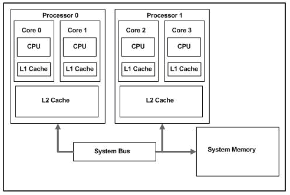

# Introduction to Scientific Programming

https://en.wikipedia.org/wiki/Scientific_programming_language

Loose def: a scientific programming language is one that is designed and optimized for the use of mathematical formula and matrices.[2] 

Scientific programming languages in the stronger sense include ALGOL, APL, Fortran, J, Julia, Maple, MATLAB and R.

Nowadays, the concept of matrices and linear algebra is extended to a concept of efficient data storage and efficient operations over them.

Key requirements:
- fast execution of the code (complex algorithms)
- ease of code reuse / restructuring 
- reproducibility of the results

Contrast to general-purpose language:
- less concern with public/private separation
- less concern with ABI 

## Example
In many applications, we encounter the task of optimization a function given by a routine (e.g. engineering, finance, etc.)

```
using Optim

P(x,y) = x^2 - 3x*y + 5y^2 - 7y + 3

z₀ = [ 0.0
       0.0 ]     # starting point for optimization algorithm

optimize(z -> P(z...), z₀, Newton())
#optimize(z -> P(z...), z₀, Newton();autodiff = :forward)
#optimize(z -> P(z...), z₀, ConjugateGradient())

```

## Quest for Speed
Great speed of computation can be achieved if we utilize full power of cuurent machines. This is very hard in reality. 

Consider a problem of multiplication of two dense matrices.
Technically trivial in C:
```
multiAB(const double *A, const double *B, double &AB)
{
    int i, j, l;

//clear result
    for (l=0; l<MR*NR; ++l) {
        AB[l] = 0;
    }
//tripple loop
    for (l=0; l<N; ++l) {
        for (j=0; j<N; ++j) {
            for (i=0; i<M; ++i) {
                AB[i+j*N] += A[i]*B[j];
            }
        }
        A += N;
        B += N;
    }
}
```

Depends on a compiler but this will be very slow.

Is it fast?
Depends a lot on size of the matrix 



cache misses.


Other reason: no threads, poor use of SSE...

### Can be done much better

Development of speed for matrix multiplication:


### Blas matrix multiplication routines
gemm | 
float, double, std::complex<float>, std::complex<double>
|
Computes a matrix-matrix product with general matrices.

hemm
|
std::complex<float>, std::complex<double>
|
Computes a matrix-matrix product where one input matrix is Hermitian and one is general.

symm
|
float, double, std::complex<float>, std::complex<double>
|
Computes a matrix-matrix product where one input matrix is symmetric and one matrix is general.

trmm
|
float, double, std::complex<float>, std::complex<double>
|
Computes a matrix-matrix product where one input matrix is triangular and one input matrix is general.


## Quest for generality

Consider implementation of quadratic form:
$$
Q = A*P*A'
$$
 For general matrices: 


### 2 language problem

Writing very efficient code requires to go down to hardware specifics -> low-level language.
Efficient code restructuring is possible when the language allows easy to handle  abstraction -> high-level language.

Classical solution = 2 languages (Matlab/C, Python/C,C++, R/C)

### BLAS
This phenomenon was recognized as early as in 1979 in linear algebra. Original Fortran library for "Basic Linear Algebra Subprograms" became standardized since then and became de-facto standard for high-performance computing.

Defines 3 levels of algebra:
1. vector operations (addition, axpy=> y=a*x+y, etc.)
2. vector/matrix operations (multiplication, gemv=>y=aAx+by)
3. matrix/matrix operations (gemm=>)


Used in Matlab, R, NumPy.

Why si BLAS so fast??
- special algorithms optimized for SSE (single instruction multiple data) instructions
    + 16 resisters of SSE imply blocking matrices into   4 blocks in parallel.
- memory alignment (cache utilization)

http://www.mathematik.uni-ulm.de/~lehn/apfel/sghpc/gemm/


### tough lab session
