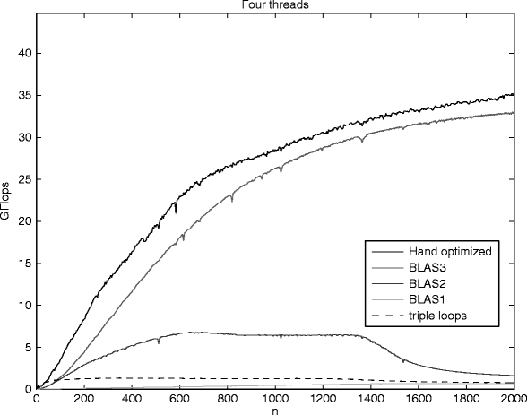
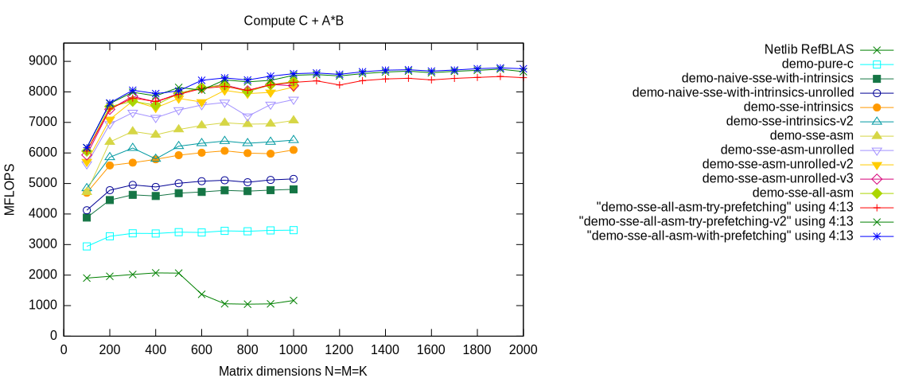

### Recap what has be taught in Lukas Adam

### Introduction to Scientific Programming

https://en.wikipedia.org/wiki/Scientific_programming_language

Loose def: a scientific programming language is one that is designed and optimized for the use of mathematical formula and matrices.[2] 

Scientific programming languages in the stronger sense include ALGOL, APL, Fortran, J, Julia, Maple, MATLAB and R.

Nowadays, the concept of matrices and linear algebra is extended to a concept of efficient data storage and efficient operations over them.

Key requirements:
- fast execution of the code (complex algorithms)
- ease of code reuse / restructuring 
- reproducibility of the results

Contrast to general-purpose language:
- less concern with public/private separation
- less concern with ABI 

### 2 language problem

Writing very efficient code requires to go down to hardware specifics -> low-level language.
Efficient code restructuring is possible when the language allows easy to handle  abstraction -> high-level language.

Classical solution = 2 languages (Matlab/C, Python/C,C++, R/C)

### BLAS
This phenomenon was recognized as early as in 1979 in linear algebra. Original Fortran library for "Basic Linear Algebra Subprograms" became standardized since then and became de-facto standard for high-performance computing.

Defines 3 levels of algebra:
1. vector operations (addition, axpy=> y=a*x+y, etc.)
2. vector/matrix operations (multiplication, gemv=>y=aAx+by)
3. matrix/matrix operations (gemm=>)

Used in Matlab, R, NumPy.

Why si BLAS so fast??
- special algorithms optimized for SSE (single instruction multiple data) instructions
    + 16 resisters of SSE imply blocking matrices into   4 blocks in parallel.
- memory alignment (cache utilization)

http://www.mathematik.uni-ulm.de/~lehn/apfel/sghpc/gemm/

Development of speed for matrix multiplication:

### tough lab session
